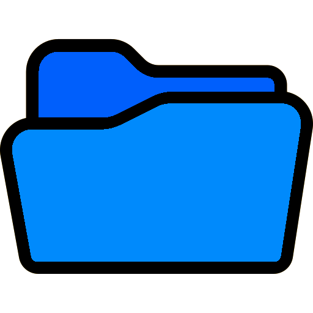
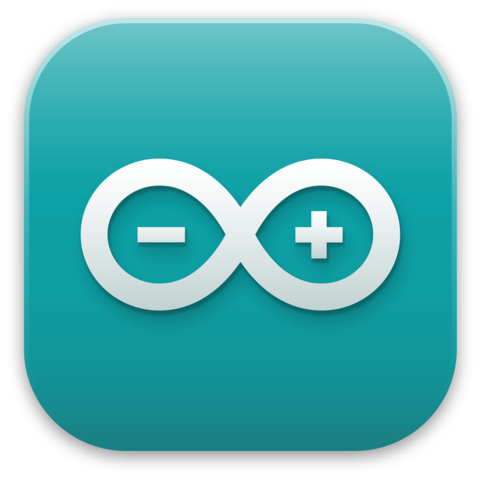

----
## 🌐 HELLO THERE! 🌐
I'm a physicist interested in the data science world
Here you gonna find some projects im making and some tips and tricks for EDA and a little more.  
Just click on the play symbol or on the description of the projects to see a list of the links to the repositories.

 
<b> Machine Learning</b>
<body>
    

        
<i>ML repositories usually culminate with the machine learning model implementation and validation.  
This repositories include exploratory data analysis, visualizations, preprocessing and preparation of data.</i>

<a href="https://github.com/NavarroRamon/DealingWith_ImbalancedData" target="_blank">
  
  <b> DealingWithImbalancedData </b> 
</a>

 
<a href="https://github.com/NavarroRamon/HeartFailure_ClassificationProblem" target="_blank">
  
  <b> HeartFailureClassificationProblem </b> 
</a>

        
</body>
<b> Python</b>
<body>
    

        
<i>This repositories contain projects made with python code.
Most of them has a GUI. Some of the libraries used are, pygame, PyQt, tkinter, selenium, etc.</i>

        

<a href="https://github.com/NavarroRamon/StocksTracker" target="_blank">
  
  <b> StocksTracker </b>
</a>

 
<a href="https://github.com/NavarroRamon/Basic-MVC-Template" target="_blank">
  
  <b> ModelViewControllerTemplate </b>
</a>

         
<a href="https://github.com/NavarroRamon/AmazonPriceTracker" target="_blank">
  
  <b> AmazonPriceTracker </b>
</a>

 
<a href="https://github.com/NavarroRamon/TheGameOfLife" target="_blank">
  
  <b> TheGameOfLife </b>
</a>

 
<a href="https://github.com/NavarroRamon/solar_system" target="_blank">
  
  <b> SolarSystem </b>
</a>

        
</body>
<b> Arduino</b>
<body>
    

        
<i>Arduino projects ready to run!. 
You will find the code and all the components needed to get the project working.</i>

<a href="https://github.com/NavarroRamon/NA" target="_blank">
  
  <b> ArduinoTamagotcheems </b> 
</a>

        
</body>
 

---

<em><b>At least... it works!</b> </em>
